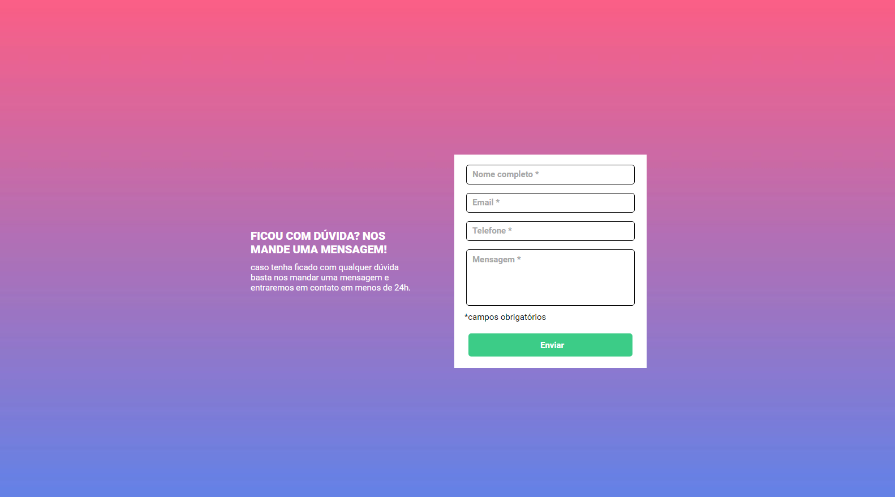

# Projeto criando e validando formulário!

# Linguagens utilizadas:

 
     
     
     
     
    

 

    # Abaixo temos a prévia do projeto!

 

<a href="https://uandersonlim.github.io/Quest-DevQues-HTML-CSS-JS/" style="border: 1px solid black; padding: 6px; background-color: #F55F8A; color: white;">Navegue até lá</a>

